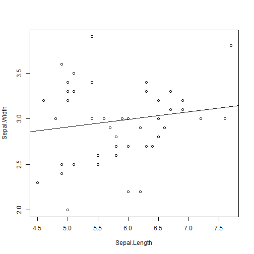

Pitch
========================================================
author: Joe M
date:  01-JAN-2021
autosize: true

IRIS PLot
========================================================

This slide outlines the process presented in the Shiny section of this project: 
https://hermitjoe.shinyapps.io/iris_plot/?_ga=2.59626926.2014271548.1609536260-1437786463.1609536260

This project has 2 tabs 
-   First: **The process**  
This form allows the user to compare 2 variables from the IRIS data set.  
Optionally, a regression line can be added.

-   Second: **User Doc**   
The user doc is a bare bone outline of the controls

Why this project
========================================================
This process created a way to look at sub sections of a pair plot in greater detail.

- Combinations of each variable can be created
- Linear Regression line to assist with seeing patterns

This process allowed for a great bit of learning and growing to complete
The final project displayed was *attempt 8* at creating the form

It has additional growth potential such as 
- Selecting different data sets (women, mtcars, etc)
- Which in turn would dynamically set the slider bounds ,and selection in the drop downs

Controls
========================================================

This process has 4 controls

- Slide bar for the number of random points to use
- 2 Drop down selection boxes to pick what variables to compare  
- Check box to toggle on/off a regression line for the plot displayed

Plot (Evaluated Example)
========================================================
Example Plot: 50 random points, comparing "Sepal.Length" to "Sepal.Width", with a regression line

